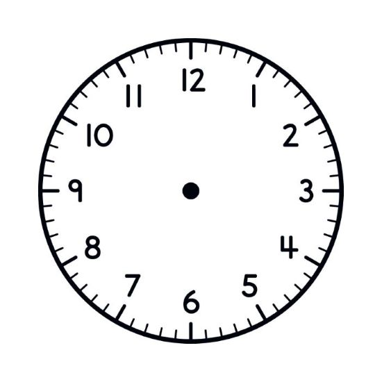

# Analog Clock

 <!-- Update the path if needed after adding the image -->

## 📖 Project Description

The **Analog Clock** is a simple tutorial that demonstrates how to build an analog clock using **JavaScript**, **CSS**, and **HTML**. This tutorial is designed to guide you in creating a dynamic clock with ticking hands, updating in real time with JavaScript.

## 🚀 Project Link

[View the Project on Vercel](https://your-vercel-link.vercel.app)

## 🛠️ Tools and Technologies

- **JavaScript**
- **HTML5**
- **SCSS**

## 💡 Features

- A fully functional analog clock with three hands (hour, minute, and second).
- Real-time hand movement using JavaScript.
- Clean and elegant design that mimics a traditional analog clock.

## 📚 Getting Started

1. Clone the project to your local machine:
   ```bash
   git clone https://github.com/kariimellsayed/Analog_Clock.git
   ```
